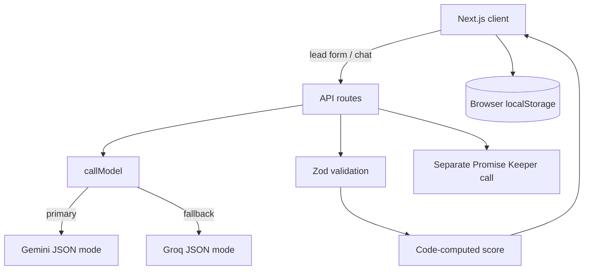

# Masal Lead Copilot

## What I built

A small assistant for Indian real-estate sales teams. It ranks inbound leads, summarizes what each buyer needs, supports lead-specific preparation chat, and tracks commitments. It is a hiring assignment demo, not a CRM.

## Architecture overview

Next.js App Router handles the screens and server API routes. Lead records live in browser localStorage. AI calls stay on the server, pass through `lib/ai.ts`, and return data validated with Zod.



## AI models and calls

The model names come from `GEMINI_MODEL` and `GROQ_MODEL`; keys are server-only. Gemini is primary through `@google/genai`; Groq is fallback through its OpenAI-compatible API. Both calls request JSON mode and the prompt describes the expected object; Zod is the single schema validator. `callModel()` uses a 12-second abort timeout per provider and a 30-second overall cap. It retries once only for 429, 5xx, or invalid JSON/schema output; timeouts move directly to the next provider. Routes expose safe error messages only.

Core analysis produces lead summary, intent, requirements, objections, next action, suggested response, and scoring signals. Code computes the 0–100 score and Hot/Warm/Cold label. Promise Keeper runs as a separate model request after analysis, so its failure cannot discard the core result. Its extracted dates are interpreted by code against the current time; the model does not decide status.

## Run locally

Copy `.env.example` to `.env.local`, then fill in provider keys. Model names are configurable there. Promise Keeper is enabled by `NEXT_PUBLIC_PROMISE_KEEPER_ENABLED=true`.

Windows PowerShell:

```powershell
npm.cmd install
npm.cmd run dev
npm.cmd run lint
npm.cmd test
npm.cmd run build
```

Other shells can use `npm` in place of `npm.cmd`. Open the local URL printed by Next.js. Five seeded sample leads load once in each browser profile so the dashboard is demo-ready without a model request.

## Key technical decisions

- The LLM interprets natural language; application code computes lead scores and promise deadlines.
- Promise Keeper uses its own call and feature flag, keeping its availability independent from core analysis.
- Leads, statuses, chat history, and commitments are saved in localStorage.
- Seeded leads make the demo usable before provider keys are configured.
- Customer text is treated as untrusted input, and unsupported property details should be verified with the project team.

## Promise Keeper

Promise Keeper extracts who promised what, the quoted source phrase, an optional deadline, customer mood, contradictions, and explicit contact windows. The salesperson can mark promises done, add or remove commitments, and create a short “Keep it” follow-up draft to copy. The Today tab sorts overdue commitments first, then due-soon commitments, with lead score breaking ties. With the flag off, Promise Keeper UI is hidden and Today shows a score-ranked lead list.

## Known limitations

- localStorage is per browser and is not shared across devices.
- The in-memory rate limiter is best-effort on serverless instances.
- There is no authentication; do not put real customer data in a public demo.
- Project profile details are fictional. The model can misread Hinglish dates or mood; review extracted details before acting.
- Drafts are for copying only; the app does not send messages or book appointments.
- Provider quotas and availability depend on the configured accounts.

## AI usage disclosure

TODO: Owner to complete with the tools used, what AI contributed, and how the output was reviewed.
